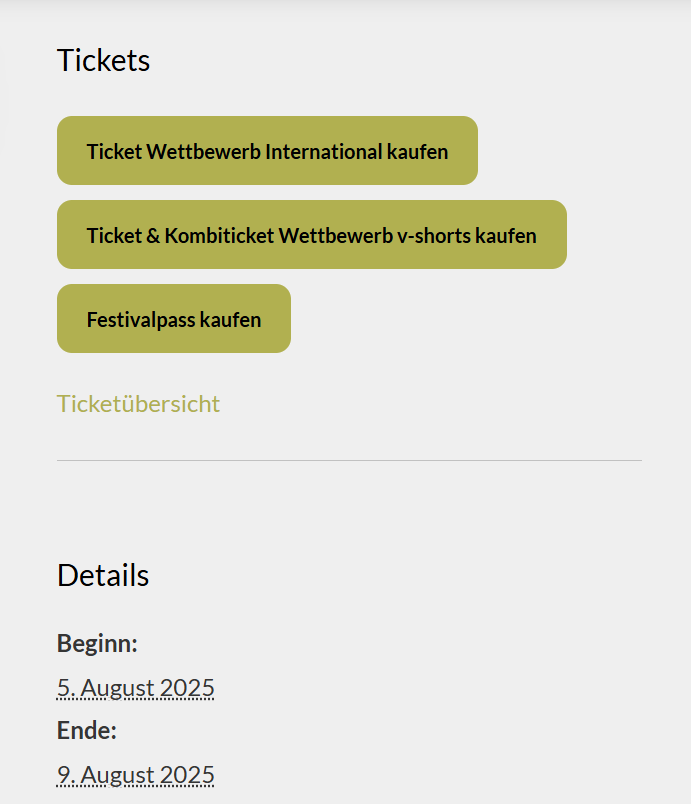
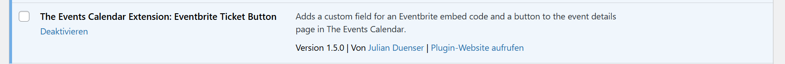
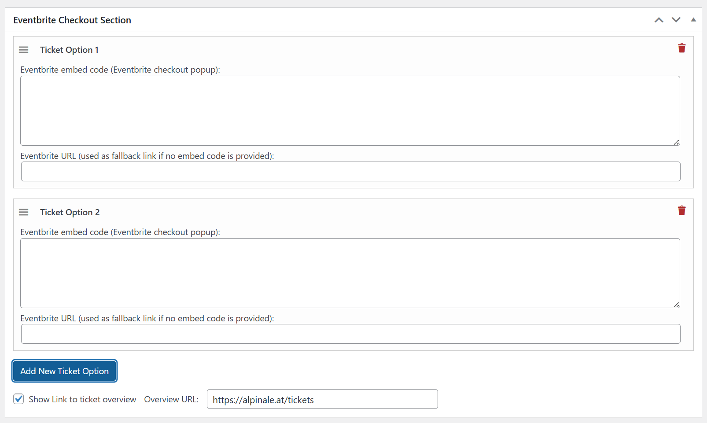

# The Events Calendar Extension: Eventbrite Ticket Button

## Wordpress Plugin Add-on
A custom extension to the plugin THE EVENTS CALENDAR https://theeventscalendar.com/ for Wordpress.

## Functionality
- Adds a custom field for an Eventbrite button embed code and a displays the embedding code 1:1 on the frontend page of the event site. 
- It is rendered in first palce on top before everything else in the sidebar (or wherever the details panel is placed)

## Screenshots

### Frontend

### Plugin overview in WordPress

### Event editor backend section

